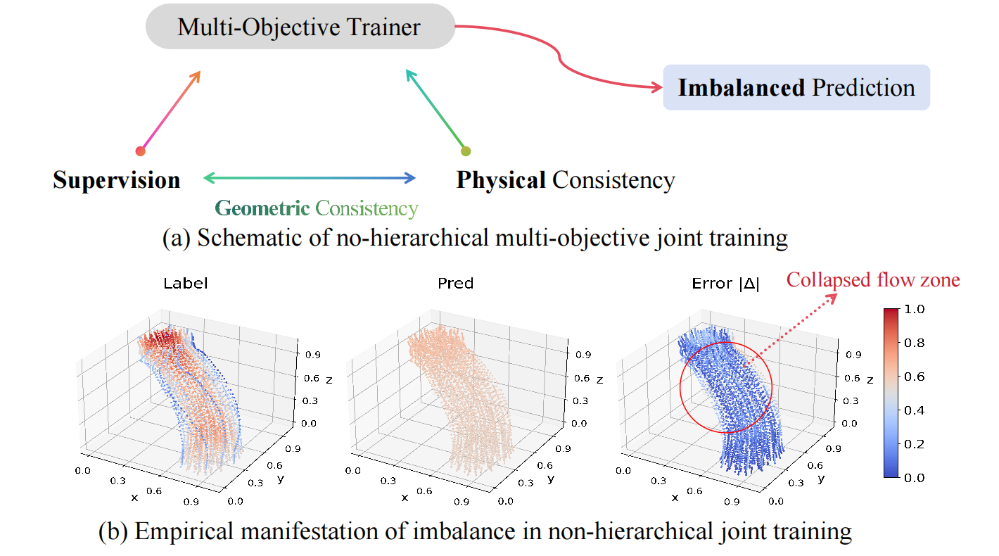
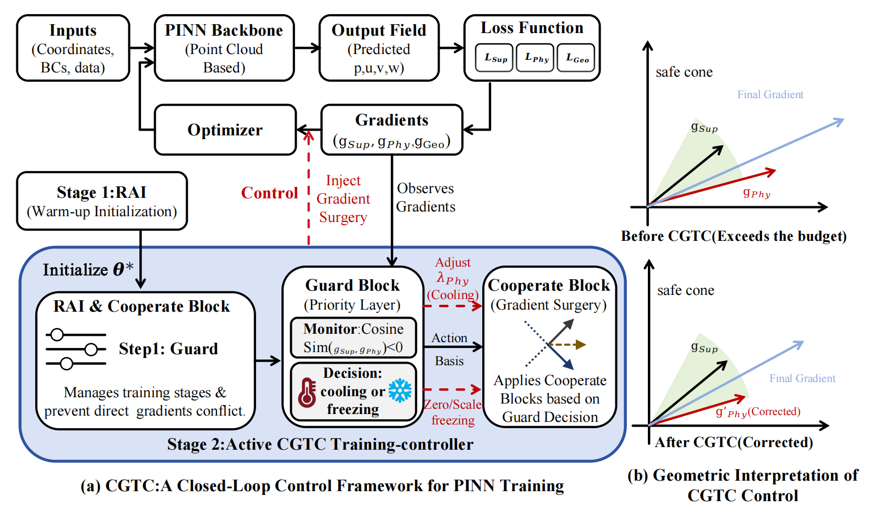
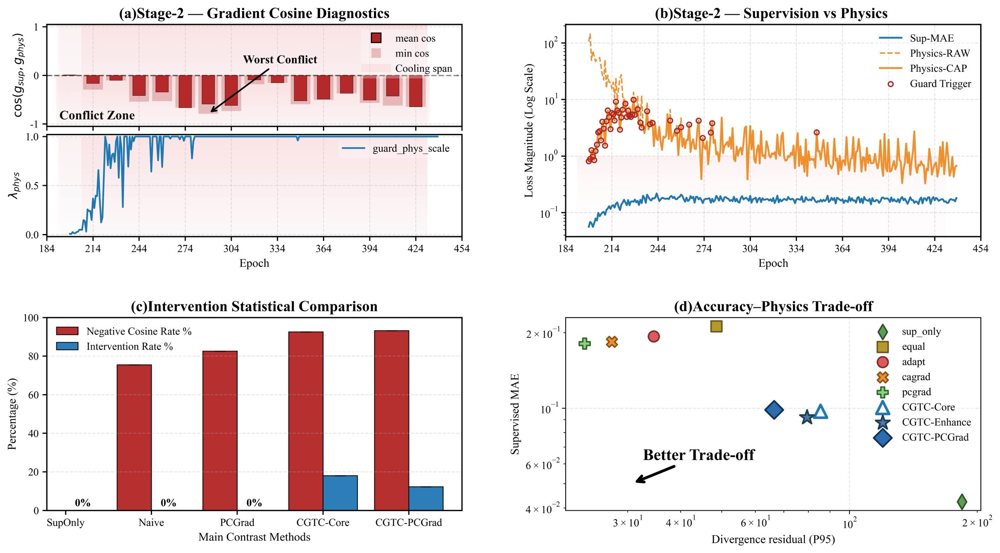

# Constraint-Guided Training Control: Hierarchical Constraints and Feedback Cooling for Stabilizing Multi-Objective Co-Learning

Physics-informed learning can improve data efficiency and physical consistency, but in supervised PINN-style training, the physics residual often introduces stiff gradients that distort optimization and drive models toward trivial low-velocity solutions on complex geometries.
Existing multi-objective approaches mainly perform \textit{passive balancing}---via ratio reweighting or local gradient conflict mitigation---which reduces step-wise interference but fails to explicitly constrain the long-horizon influence of auxiliary objectives.
In this paper, we propose \textit{Constraint-Guided Training Control (CGTC)}, a lightweight training-time control strategy for multi-objective physics-regularized learning.
Under a supervision-first instantiation, CGTC establishes an auto-calibrated supervision-centered trust region by bounding auxiliary-to-supervised gradient ratios, and deploys closed-loop feedback actions when supervised progress stalls under persistent conflict.
The framework is plug-and-play and compatible with existing weighting or gradient-modification methods.
Evaluated on vascular hemodynamics point-cloud regression across diverse anatomies, lesions, and scanner vendors, CGTC effectively prevents flow-field collapse and improves tail-sensitive physics consistency while preserving supervised accuracy.
Crucially, it remains stable under fixed hyperparameters across backbones, noise levels, sparsity, and OOD shifts.

## Overview

This repository implements a training/evaluation pipeline for point cloud flow field reconstruction: using supervised loss as the primary objective, augmented with continuity and momentum residuals (PINN) constraints, and providing stable training mechanisms including teacher EMA, hierarchical guards, cooling, and multi-objective gradient solvers.



## Method



## Results

### Error Visualization


### Analysis


## Features

- **Supervised Learning Backbone**: PointNet++ / PointTransformer for regressing `p,u,v,w` on point clouds.
- **Physics Constraints (PINN)**: Continuity and momentum residuals based on kNN + least-squares gradient estimation.
- **Training Stabilization Mechanisms**:
  - Gradient/loss ratio guards (switchable, with auto-threshold support).
  - Cooling windows and guard-backoff.
  - Teacher EMA + consistency loss.
  - Multi-objective gradient solving (sum / PCGrad / CAGrad).
- **Robustness & OOD Perturbations**: Independent configuration for train/validation/test sampling, noise, occlusion, scaling, and rotation.
- **Evaluation & Visualization**:
  - `test.py`: Generate prediction/error visualizations and physics statistics.
  - `eval/eval_physics.py`: Batch physics statistics with optional histograms.
  - `eval/posthoc_runner.py`: Post-hoc supervised + physics evaluation for specified weights.

## Directory Structure

- `CGTC/train.py`: Training entry point, builds data, models, Trainer, and saves weights and curves.
- `CGTC/test.py`: Testing and visualization entry point, supports fixed sample visualization and physics evaluation.
- `CGTC/eval/eval_physics.py`: Batch physics evaluation (divergence + momentum residuals) with CSV/histogram outputs.
- `CGTC/eval/posthoc_runner.py`: Post-hoc evaluation wrapper (load weights -> supervised eval -> physics eval).
- `CGTC/training/trainer.py`: Complete training loop with guard/cooling/EMA/multi-objective solving.
- `CGTC/models/`: PointNet2/PointTransformer backbones and PINN computations.
- `CGTC/configs/default.yaml`: Default training configuration.

## Data & Dependencies

Training/evaluation depends on the `data.dataset` module (`pointdata`, `norm_data`, `build_out_csv_from_dir`). This module is not included in this repository and must be provided in `PYTHONPATH`. The expected data directory structure is:

```
<ROOT>/
  data/
    dataset/
      <CASE>/
        train/   # Training point cloud samples
        test/    # Validation/test point cloud samples
  results/
    temp_results/
      <CASE>/<TAG>/
        weight/  # Weight outputs
        curves/  # Curve outputs
```

## Quick Start

### Training

```bash
python CGTC/train.py \
  --cfg CGTC/configs/default.yaml \
  --root /path/to/project \
  --case C1 \
  --tag demo \
  --device cuda:0 \
  --pts 4096 \
  --batch 8 \
  --workers 4
```

Training outputs are located at:

```
results/temp_results/<CASE>/<TAG>/
  weight/final_reco.pth
  train_val_metrics.csv
  curves/loss_curve.png
```

### Training with Robustness/OOD Perturbations

```bash
python CGTC/train.py \
  --cfg CGTC/configs/default.yaml \
  --root /path/to/project \
  --case C1 \
  --tag robust_demo \
  --subsample_ratio 0.5 \
  --coord_noise_sigma 0.002 \
  --occlusion_ratio 0.2 \
  --ood_rotation \
  --ood_rot_deg 60
```

### Testing & Visualization

```bash
python CGTC/test.py \
  --root /path/to/project \
  --case C1 \
  --tag demo \
  --device cuda:0 \
  --pts 4096 \
  --vis_indices 0,5,12 \
  --phys_max_items 6
```

Outputs include:

- `pred_vs_real_puvw.png`: Legacy single-sample comparison plot (random sample).
- `samples_vis/idx_XXXX/`: Traceable visualization for fixed indices.
- `div_hist.png` / `mom_hist.png` / `phys_stats.csv`: Physics statistics and histograms.

### Batch Physics Evaluation

```bash
python CGTC/eval/eval_physics.py \
  --cfg CGTC/configs/default.yaml \
  --root /path/to/project \
  --case C1 \
  --split test \
  --pts 4096 \
  --ckpt-dir results/temp_results/C1/demo/weight \
  --out results/temp_results/C1/demo/physics_eval.csv
```

### Post-hoc Evaluation (Optional)

```bash
python - <<'PY'
from pathlib import Path
from CGTC.eval.posthoc_runner import run_posthoc
from CGTC.models.backbone import build_backbone
from types import SimpleNamespace as NS

cfg = NS(models=NS(backbone=NS(name="pointnet2pp_ssg", args={})))
model = build_backbone(cfg)

run_posthoc(
    model,
    dl=None,  # Optionally pass DataLoader for supervised evaluation
    weight_path=Path("results/temp_results/C1/demo/weight/final_reco.pth"),
    device="cuda:0",
    out_dir=Path("results/temp_results/C1/demo/posthoc"),
)
PY
```

## Training Pipeline Highlights

- **Phased Training**: Warm-up (supervised-only) before entering PINN constraint phase; supports rollback and teacher freezing.
- **Guards & Cooling**: Limit physics terms based on loss or gradient ratios; trigger cooling windows and reduce physics weights when activated.
- **Multi-objective Solving**: Enable PCGrad/CAGrad when supervised + spatial/physics terms conflict.
- **Robust Perturbations**: Independent perturbation configuration for train/validation/test, recorded in run metadata.

For more parameters and default values, see `CGTC/configs/default.yaml` and comments in each module.
